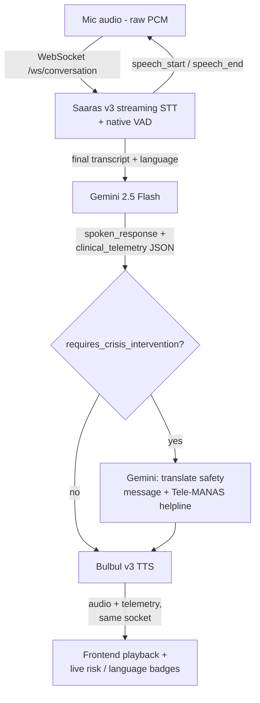

<div align="center">

# 🧠 MindWell

### **Real-Time Voice-First Mental Health Screening & Crisis Triage Engine**

[](https://www.python.org/)
[](https://fastapi.tiangolo.com/)
[](https://deepmind.google/technologies/gemini/)
[](https://www.sarvam.ai/)
[](https://reactjs.org/)
[](https://opensource.org/licenses/MIT)

*An empathetic, low-latency conversational companion designed to lower barriers to early mental health support using acoustic signals, clinical frameworks (PHQ-9/GAD-7), and localized multilingual voice AI.*

</div>

---

## 📑 Table of Contents

- [Executive Overview](#-executive-overview)
- [Key Features](#-key-features)
- [System Architecture](#-system-architecture)
- [Tech Stack](#-tech-stack)
- [Project Structure](#-project-structure)
- [Getting Started](#-getting-started)
  - [Prerequisites](#prerequisites)
  - [Environment Configuration](#environment-configuration)
  - [Backend Setup](#backend-setup)
  - [Frontend Setup](#frontend-setup)
- [Clinical & Telemetry Schemas](#-clinical--telemetry-schemas)
- [Safety & Crisis Intervention](#-safety--crisis-intervention)
- [Future Directions](#-future-directions)
- [Medical Disclaimer](#-medical-disclaimer)
- [License](#-license)

---

## 🔬 Executive Overview

Mental health challenges among students and young adults frequently go undetected due to social stigma, high consultation costs, and shortages of qualified counseling staff. Standard text-based chatbots often feel cold, clinical, and detached, failing to capture the nuance of spoken human emotion.

**MindWell** bridges this gap with a low-latency, voice-first screening experience. By pairing **Sarvam AI's native speech intelligence** with **Google Gemini's reasoning engine**, MindWell conducts warm, context-aware conversations over a persistent voice session, extracts clinical distress markers in real time, and surfaces early risk indicators — all while remaining affordable and localized to Indian languages.

---

## ✨ Key Features

* 🎙️ **Native Code-Mixed Voice Support**: Powered by Sarvam Saaras v3, MindWell transcribes and understands Hinglish, regional phrases, and mid-sentence language switches common across India.
* 🔄 **Real-Time Streaming Turn-Taking**: Audio streams continuously over a single WebSocket session. Saaras's own voice-activity signals (`speech_start` / `speech_end`) drive turn-taking natively — no separate VAD model and no manual "push to talk."
* 🧠 **Gemini-Powered Clinical Reasoning**: A single Gemini 2.5 Flash call per turn returns both an empathetic spoken reply and structured PHQ-9/GAD-7 risk telemetry, so clinical signal extraction never adds a visible extra step for the user.
* 🗣️ **Human-like Regional Voice Synthesis**: Generates expressive, calm speech responses using Sarvam Bulbul v3 with regional voices (Meera, Ritu, and others).
* 📊 **Live Risk & Language Badges**: The UI surfaces detected language and PHQ-9/GAD-7 risk levels turn-by-turn, without interrupting the conversation flow.
* 🚨 **Automated Emergency Safety Protocols**: The moment a crisis signal fires, a dedicated follow-up call swaps in a translated safety message with crisis helpline details (e.g., Tele-MANAS) before anything is spoken.
* 🔌 **REST Fallback**: A single-shot `/api/v1/voice-turn` endpoint runs the same STT → Gemini → TTS pipeline for non-streaming integrations.
* 🔒 **Onshore & Privacy-Conscious**: Built with data handling aligned to DPDP (Digital Personal Data Protection) Act expectations.

---

## 📐 System Architecture



The frontend captures microphone audio and streams it to the backend the moment the session starts — there's no record-then-upload step. Saaras's own VAD detects speech boundaries and reports them back over the same socket, so the UI can show a live "listening" state. A non-streaming REST fallback (`POST /api/v1/voice-turn`) runs the identical STT → Gemini → TTS logic for single-shot audio uploads, for integrations that don't need the WebSocket layer.

---

## 🛠️ Tech Stack

### **Core AI & Speech Engines**
* **Intelligence Layer**: [Google Gemini 2.5 Flash](https://deepmind.google/technologies/gemini/) — structured JSON output, single call returns both the spoken reply and clinical telemetry
* **Speech-to-Text (STT)**: [Sarvam AI Saaras v3](https://www.sarvam.ai/) — streaming, multilingual, code-mixed voice recognition with built-in VAD
* **Text-to-Speech (TTS)**: [Sarvam AI Bulbul v3](https://www.sarvam.ai/) — high-expressivity Indian regional voices

### **Backend Gateway**
* **Framework**: FastAPI (Python 3.10+)
* **Concurrency**: Asyncio & Uvicorn ASGI server, `websockets` for the streaming transport
* **SDKs**: `google-genai`, `sarvamai` (async client)

### **Frontend Interface**
* **Framework**: React 18 + Vite
* **Styling**: Tailwind CSS with a custom dark theme (violet / teal / rose accents)
* **Animation**: Framer Motion (turn-taking states, staggered text reveals, ambient background)
* **Audio Capture**: Web Audio API (`AudioContext` + `ScriptProcessorNode`) — captures and downsamples mic input to 16 kHz PCM for streaming

---

## 📂 Project Structure

```text
mindwell/
├── cloud-functions/                  # FastAPI backend gateway
│   ├── main.py                       # WebSocket + REST pipeline (STT → Gemini → TTS)
│   ├── requirements.txt              # Python dependencies
│   ├── test_gemini.py                # Gemini prompt validation script
│   └── test_complex_scenarios.py     # Clinical edge-case test suite
├── frontend/                         # React single-page application
│   ├── public/                       # Static assets
│   ├── src/
│   │   ├── components/
│   │   │   └── Conversation.jsx      # Voice UI: WebSocket client, PCM capture, live badges
│   │   ├── App.jsx                   # App shell & intro animation
│   │   ├── index.css                 # Tailwind base styles
│   │   └── main.jsx                  # React entrypoint
│   ├── package.json                  # Frontend dependencies
│   ├── tailwind.config.js            # Custom theme (violet / teal / rose accents)
│   └── vite.config.js                # Vite build configuration
├── test_backend.py                   # Root-level backend smoke test
├── run_backend.ps1                   # Windows helper script to launch the backend
├── PROMPT_SETUP.md                   # Gemini system prompt & clinical framework spec
└── README.md
```

---

## 🚀 Getting Started

### Prerequisites
- Python 3.10 or higher
- Node.js v18+ and npm
- API keys: a Google Gemini API key, and a Sarvam AI subscription key

### Environment Configuration
Create a `.env` file inside `cloud-functions/`:

```env
# Core API Keys
GEMINI_API_KEY="your-google-gemini-api-key"
SARVAM_API_KEY="your-sarvam-ai-api-key"

# Voice & Model Configuration
SARVAM_STT_MODEL="saaras:v3"
SARVAM_TTS_MODEL="bulbul:v3"
SARVAM_DEFAULT_VOICE="meera"
DEFAULT_LANGUAGE_CODE="en-IN"
```

### Backend Setup
```bash
# Navigate to backend directory
cd cloud-functions

# Create and activate a virtual environment
python -m venv venv
source venv/bin/activate  # On Windows: venv\Scripts\activate

# Install dependencies
pip install -r requirements.txt

# Start the FastAPI development server
uvicorn main:app --reload --port 8000
```
The API is available at `http://localhost:8000` (Swagger docs at `http://localhost:8000/docs`).

### Frontend Setup
```bash
# Navigate to frontend directory
cd frontend

# Install dependencies
npm install

# Start the Vite dev server
npm run dev
```
The app is available at `http://localhost:5173`.

> **Note**: the backend WebSocket URL is currently a hardcoded constant (`WS_URL` in `frontend/src/components/Conversation.jsx`), not an environment variable. If your backend isn't running on `localhost:8000`, update that constant before running the frontend.

---

## 📊 Clinical & Telemetry Schemas

Every voice turn, Gemini returns a single JSON object containing both the conversational reply and structured telemetry, so clinical signals are captured without ever interrupting the conversation:

```json
{
  "spoken_response": "I hear how heavy things feel right now with your upcoming exams. It is completely natural to feel overwhelmed, but remember to take things one step at a time.",
  "clinical_telemetry": {
    "detected_emotions": ["anxiety", "academic_stress"],
    "phq9_risk_indicator": "moderate",
    "gad7_risk_indicator": "high",
    "requires_crisis_intervention": false,
    "recommended_resource": "breathing_exercise"
  }
}
```

---

## 🚨 Safety & Crisis Intervention

MindWell runs a two-step safety circuit on every turn:

1. **Risk assessment**: Gemini evaluates the transcript against its clinical system prompt and sets `requires_crisis_intervention: true` whenever it detects acute risk phrases, self-harm signals, or extreme despair — as part of the same JSON call that produces the normal reply.
2. **Safety override**: if that flag fires, a dedicated follow-up Gemini call translates a fixed, pre-written safety message — including the Tele-MANAS helpline — into the user's detected language, and that message is spoken instead of the model's usual response.

**Emergency helplines (India)**
- Tele-MANAS: 14416 or 1800-891-4416
- KIRAN: 1800-599-0019

---

## 🗺️ Future Directions

*Exploratory ideas, not committed plans:*
- An aggregated, anonymized risk-trend dashboard for institutions or counselors, rather than only per-session telemetry.
- Broader Indic language coverage as Saaras and Bulbul expand supported locales.
- A lower-latency real-time transport (e.g., LiveKit) as the WebSocket layer scales.
- A mobile client wrapping the same conversation pipeline.

---

## ⚠️ Medical Disclaimer

**IMPORTANT**: MindWell is an AI-powered screening and emotional grounding companion. It does not provide medical advice, psychiatric diagnosis, or formal clinical treatment. MindWell is intended solely for early self-reflection and triage. Anyone experiencing a mental health emergency should immediately contact qualified healthcare professionals or emergency hotline services.

---

## 📜 License

Distributed under the MIT License. See `LICENSE` for details.
